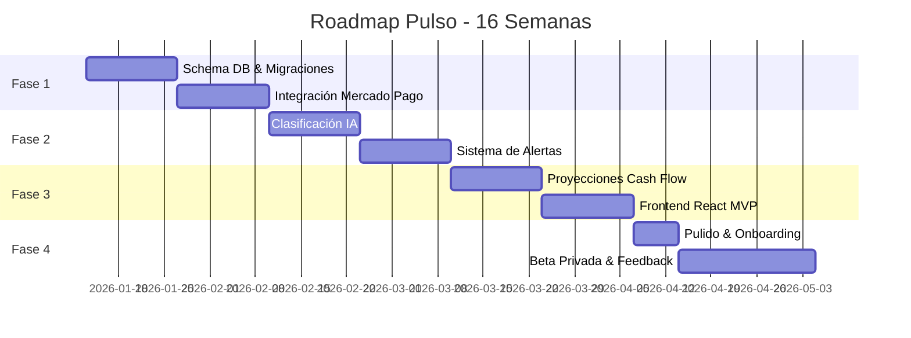

# 🚀 PULSO - Roadmap de Desarrollo
## Panel Inteligente de Control Financiero para PyMEs Argentinas

> **Duración Total:** 16 semanas  
> **Objetivo Final:** MVP validado con 10 beta testers pagando  
> **Inicio Estimado:** Q1 2026

---

## 📋 Resumen Visual del Roadmap



---

## 🎯 Visión por Fase

| Fase | Semanas | Tema Central | Entregable Clave |
|:----:|:-------:|--------------|------------------|
| 🏗️ **1** | 1-4 | Fundación Crítica | Dashboard con transacciones MP reales |
| 🧠 **2** | 5-8 | Motor Inteligente | Alertas proactivas funcionando |
| 📊 **3** | 9-12 | Proyecciones & UI | App web funcional end-to-end |
| 🧪 **4** | 13-16 | Beta Privada | Product-market fit validado |

---

# 🏗️ FASE 1: Fundación Crítica
## Semanas 1-4

> **🎯 Objetivo:** Base de datos sólida y conexión con dinero real de Mercado Pago

---

### 📅 Semanas 1-2: Schema de Base de Datos ✅ COMPLETADO (2026-01-08)

#### Implementado

| Archivo | Descripción |
|---------|-------------|
| `database/schema.sql` | 10 tablas, índices, triggers, view `dashboard_resumen` |
| `database/seed_categorias.sql` | 32 categorías predefinidas argentinas |
| `database/init.sql` | Script de inicialización |
| `database/README.md` | Documentación de instalación |

#### Tareas Completadas

| # | Tarea | Estado |
|:-:|-------|:------:|
| 1 | Diseñar schema.sql completo con todas las tablas | ✅ |
| 2 | Crear seed de categorías predefinidas argentinas | ✅ |
| 3 | Documentar | ✅ |

#### Tablas a Implementar

```sql
-- Orden de creación (por dependencias)
1. empresas          -- Entidad principal
2. usuarios          -- Usuarios con roles
3. categorias        -- Predefinidas + custom
4. cuentas_bancarias -- Conexiones MP/bancos
5. movimientos       -- Transacciones
6. clasificaciones   -- Histórico IA
7. alertas           -- Notificaciones
8. proyecciones_cash -- Predicciones
9. audit_log         -- Seguridad
```

#### Categorías Predefinidas Argentinas 🇦🇷

| Tipo | Categorías |
|------|------------|
| **Ingresos** | Ventas productos, Servicios profesionales, Cobros clientes, Transferencias recibidas, Otros ingresos |
| **Egresos Operativos** | Compras mercadería, Servicios (luz/gas/agua/internet), Alquiler local, Sueldos y cargas sociales, Honorarios contables |
| **Egresos Impositivos** | Monotributo, IVA, IIBB, Retenciones AFIP, Anticipos Ganancias |
| **Egresos Financieros** | Comisiones MP/banco, Intereses préstamos, Tarjeta de crédito |

---

### 📅 Semanas 3-4: Integración Mercado Pago OAuth ⏸️ POSPUESTO

> **Estado:** Pendiente de credenciales de MP Developers. Se retomará cuando estén disponibles.

#### Tareas Pendientes

| # | Tarea | Estado |
|:-:|-------|:------:|
| 1 | Implementar flow OAuth 2.0 completo | ⏸️ |
| 2 | Sincronización de transacciones | ⏸️ |
| 3 | Webhooks para updates real-time | ⏸️ |
| 4 | Encriptación de tokens (AES-256) | ⏸️ |

#### Flow de Autorización

```
┌─────────────────────────────────────────────────────────────────────────────┐
│                         FLOW OAUTH MERCADO PAGO                              │
├─────────────────────────────────────────────────────────────────────────────┤
│                                                                              │
│  [1] Usuario clickea "Conectar Mercado Pago"                                │
│       │                                                                      │
│       ▼                                                                      │
│  [2] Redirect → auth.mercadopago.com.ar/authorization                       │
│       │         ?client_id=APP_ID                                            │
│       │         &redirect_uri=pulso.app/callback/mp                          │
│       │         &response_type=code                                          │
│       │         &scope=read write offline_access                             │
│       ▼                                                                      │
│  [3] Usuario autoriza en MP                                                  │
│       │                                                                      │
│       ▼                                                                      │
│  [4] MP redirect → pulso.app/callback/mp?code=AUTH_CODE                     │
│       │                                                                      │
│       ▼                                                                      │
│  [5] Backend intercambia code por access_token + refresh_token              │
│       │                                                                      │
│       ▼                                                                      │
│  [6] Tokens encriptados (AES-256) → tabla cuentas_bancarias                 │
│       │                                                                      │
│       ▼                                                                      │
│  [7] Job inicial: sincronizar últimos 90 días de transacciones              │
│       │                                                                      │
│       ▼                                                                      │
│  [8] Webhook configurado para nuevas transacciones                          │
│                                                                              │
└─────────────────────────────────────────────────────────────────────────────┘
```

#### Estructura de Webhook

```javascript
// POST /api/v1/webhooks/mercadopago
{
  "action": "payment.created",
  "data": {
    "id": "123456789"
  },
  "user_id": "MP_USER_ID",
  "live_mode": true
}
```

---

### ✅ Entregable Fase 1

> **Dashboard mostrando transacciones reales de Mercado Pago**

| Criterio de Aceptación | Check |
|------------------------|:-----:|
| Usuario puede conectar cuenta MP | ⬜ |
| Transacciones se sincronizan automáticamente | ⬜ |
| Dashboard muestra cash total real | ⬜ |
| Webhooks actualizan en tiempo real | ⬜ |
| Tokens almacenados encriptados | ⬜ |

---

# 🧠 FASE 2: Motor Inteligente ✅ COMPLETADO (2026-01-08)
## Semanas 5-8

> **🎯 Objetivo:** Que el sistema "piense" por el usuario y avise proactivamente

---

### 📅 Semanas 5-6: Clasificación con IA ✅ COMPLETADO

#### Implementado

| Archivo | Descripción |
|---------|-------------|
| `src/services/openaiClient.js` | Cliente OpenAI con retry logic |
| `src/services/iaService.js` | Motor de clasificación, batch, feedback |
| `src/routes/ia.js` | Endpoints: clasificar, batch, feedback, métricas |

---

### 📅 Semanas 7-8: Sistema de Alertas ✅ COMPLETADO

#### Implementado

| Archivo | Descripción |
|---------|-------------|
| `src/services/alertasService.js` | Reglas: cash bajo, gasto inusual, sin actividad, vencimientos |
| `src/routes/alertas.js` | Endpoints: listar, contar, evaluar, leer, descartar |

#### Arquitectura del Motor IA

```
┌──────────────────────────────────────────────────────────────────┐
│                    MOTOR DE CLASIFICACIÓN IA                      │
├──────────────────────────────────────────────────────────────────┤
│                                                                   │
│  ┌─────────────────┐    ┌─────────────────┐    ┌──────────────┐  │
│  │   Movimiento    │───▶│   Pre-proceso   │───▶│   OpenAI     │  │
│  │   sin clasificar│    │   - Normalizar  │    │   GPT-4      │  │
│  └─────────────────┘    │   - Contexto AR │    └──────┬───────┘  │
│                         └─────────────────┘           │          │
│                                                       ▼          │
│  ┌─────────────────┐    ┌─────────────────┐    ┌──────────────┐  │
│  │   Movimiento    │◀───│   Post-proceso  │◀───│   Response   │  │
│  │   clasificado   │    │   - Validar     │    │   Parser     │  │
│  └─────────────────┘    │   - Guardar     │    └──────────────┘  │
│         │               └─────────────────┘                      │
│         ▼                                                        │
│  ┌─────────────────────────────────────────────────────────────┐ │
│  │                    FEEDBACK LOOP                             │ │
│  │  Usuario corrige → Se guarda corrección → Mejora prompt     │ │
│  └─────────────────────────────────────────────────────────────┘ │
│                                                                   │
└──────────────────────────────────────────────────────────────────┘
```

#### Prompt Base para Contexto Argentino

```javascript
const SYSTEM_PROMPT = `
Eres un contador experto en PyMEs argentinas. Tu tarea es clasificar 
transacciones financieras en las categorías correctas.

CONTEXTO:
- Las transacciones provienen de Mercado Pago Argentina
- La empresa puede ser monotributista o responsable inscripto
- Considera los impuestos argentinos: Monotributo, IVA, IIBB, AFIP

REGLAS:
1. Si ves "AFIP" o "ARCA", es pago de impuestos
2. Si ves "TRANSFERENCIA DE" es cobro de cliente
3. Si ves fechas 1-5 del mes con monto fijo, probablemente es alquiler o servicio
4. Comisiones de Mercado Pago van a "Comisiones financieras"

Responde SOLO con JSON: { "categoria_id": "uuid", "confianza": 0.0-1.0 }
`;
```

---

### 📅 Semanas 7-8: Sistema de Alertas

#### Tareas Detalladas

| # | Tarea | Prioridad | Estimación |
|:-:|-------|:---------:|:----------:|
| 1 | Definir reglas de alertas base | 🔴 Alta | 4h |
| 2 | Crear motor de evaluación (cron job cada hora) | 🔴 Alta | 8h |
| 3 | Implementar endpoint `/api/v1/alertas` | 🔴 Alta | 4h |
| 4 | Notificaciones in-app con conteo | 🔴 Alta | 4h |
| 5 | Panel de configuración de umbrales | 🟡 Media | 6h |
| 6 | Historial de alertas disparadas | 🟡 Media | 4h |

#### Tipos de Alertas Base

| Tipo | Trigger | Severidad | Mensaje Ejemplo |
|------|---------|:---------:|-----------------|
| 💸 **Cash Bajo** | cash_total < umbral_definido | 🔴 Critical | "Tu saldo proyecta estar en rojo en 7 días" |
| 📈 **Gasto Inusual** | gasto > 150% promedio categoría | 🟡 Warning | "Gastos en Servicios 80% más alto que lo normal" |
| 📅 **Vencimiento** | fecha_vcto - hoy <= 3 días | 🟡 Warning | "Vence Monotributo en 3 días" |
| 🔄 **Sin Actividad** | días_sin_movimiento > 7 | 🟢 Info | "No hay movimientos hace 7 días" |
| 🎯 **Meta Alcanzada** | ingresos_mes >= meta | 🟢 Info | "¡Felicitaciones! Alcanzaste tu meta de ingresos" |

#### Arquitectura del Motor de Alertas

```
┌───────────────────────────────────────────────────────────────────┐
│                      MOTOR DE ALERTAS                              │
├───────────────────────────────────────────────────────────────────┤
│                                                                    │
│  ┌────────────────┐                                                │
│  │   CRON JOB     │  Cada hora                                     │
│  │   (BullMQ)     │────────────────────────────────┐               │
│  └────────────────┘                                │               │
│                                                    ▼               │
│  ┌────────────────────────────────────────────────────────────┐   │
│  │                    POR CADA EMPRESA                         │   │
│  ├────────────────────────────────────────────────────────────┤   │
│  │  1. Calcular métricas actuales                              │   │
│  │     - cash_total                                            │   │
│  │     - gastos_por_categoria_vs_promedio                      │   │
│  │     - vencimientos_proximos                                 │   │
│  │                                                             │   │
│  │  2. Evaluar reglas activas                                  │   │
│  │     - Comparar con umbrales configurados                    │   │
│  │                                                             │   │
│  │  3. Si regla cumple Y no hay alerta reciente (24h)         │   │
│  │     → INSERT INTO alertas                                   │   │
│  │     → Marcar para notificación                              │   │
│  └────────────────────────────────────────────────────────────┘   │
│                                                                    │
└───────────────────────────────────────────────────────────────────┘
```

---

### ✅ Entregable Fase 2

> **Sistema que avisa proactivamente sobre problemas financieros**

| Criterio de Aceptación | Check |
|------------------------|:-----:|
| 75%+ de transacciones clasificadas correctamente | ⬜ |
| Usuario puede corregir clasificaciones | ⬜ |
| Alertas se disparan automáticamente | ⬜ |
| Dashboard muestra contador de alertas | ⬜ |
| Usuario puede configurar umbrales | ⬜ |

---

# 📊 FASE 3: Proyecciones & Frontend
## Semanas 9-12

> **🎯 Objetivo:** Dashboard visual completo con proyecciones precisas

---

### 📅 Semanas 9-10: Proyecciones de Cash Flow ✅ COMPLETADO (2026-01-08)

#### Implementado

| Archivo | Descripción |
|---------|-------------|
| `src/services/proyeccionesService.js` | Algoritmo de predicción, patrones, estacionalidad |
| `src/routes/proyecciones.js` | Endpoints: proyecciones, generar, resumen, escenarios |

---

### 📅 Semanas 11-12: Frontend React MVP ⏸️ SEPARADO

> **Nota:** El frontend se desarrollará en un repositorio separado.
> La API backend está lista para consumir.


#### Algoritmo de Proyección

```javascript
// Pseudo-código del algoritmo
function proyectarCashFlow(empresaId, diasFuturos) {
  // 1. Obtener histórico (últimos 90 días mínimo)
  const historico = await getMovimientos(empresaId, -90);
  
  // 2. Detectar patrones recurrentes
  const patronesFijos = detectarPatronesRecurrentes(historico);
  // Ej: Alquiler día 5, Monotributo día 20, Servicios variable
  
  // 3. Calcular promedios por tipo
  const promedioIngresos = calcularPromedioDiario(historico, 'ingreso');
  const promedioEgresos = calcularPromedioDiario(historico, 'egreso');
  
  // 4. Ajustar por estacionalidad
  const factorEstacional = getFactorEstacional(mes);
  // Ej: Diciembre = 1.3 (más ventas), Enero = 0.7 (vacaciones)
  
  // 5. Generar proyección día a día
  let cashProyectado = await getCashActual(empresaId);
  const proyeccion = [];
  
  for (let dia = 1; dia <= diasFuturos; dia++) {
    const fecha = addDays(today, dia);
    
    // Sumar/restar patrones fijos de esa fecha
    cashProyectado += getPatronFijo(patronesFijos, fecha);
    
    // Sumar estimado variable
    cashProyectado += (promedioIngresos - promedioEgresos) * factorEstacional;
    
    proyeccion.push({
      fecha,
      cash_optimista: cashProyectado * 1.15,
      cash_realista: cashProyectado,
      cash_pesimista: cashProyectado * 0.85,
      confianza: calcularConfianza(dia) // Decrece con el tiempo
    });
  }
  
  return proyeccion;
}
```

#### Visualización de Proyecciones

```
                    PROYECCIÓN DE CASH FLOW - 30 DÍAS
    $
    │
800K├─ ─ ─ ─ ─ ─ ─ ─ ─ ─ ─ ─ ─ ─ ─╔═══════════╗ Optimista
    │                            ╔╝           ║
600K├─ ─ ─ ─ ─ ─ ─ ─ ─ ─ ─ ─ ─ ╔╝            ║
    │                          ╔╝─────────────╝ Realista
500K├─────────────────────────╔╝
    │                        ╔╝
400K├─ ─ ─ ─ ─ ─ ─ ─ ─ ─ ─ ╔╝╚═══════════════╝ Pesimista
    │                      ║
300K├──────────────────────╝   ← Hoy
    │          ↑ Pago quincenal
    └──────────────────────────────────────────────▶ Días
         5        10        15        20        25        30
```

---

### 📅 Semanas 11-12: Frontend React MVP

#### Pantallas a Implementar

| Pantalla | Prioridad | Componentes Principales |
|----------|:---------:|------------------------|
| Dashboard Principal | 🔴 Alta | Cards KPI, Gráfico tendencia, Alertas |
| Lista de Movimientos | 🔴 Alta | Tabla, Filtros, Clasificación inline |
| Detalle Movimiento | 🟡 Media | Info completa, Cambiar categoría |
| Proyecciones | 🔴 Alta | Chart.js línea con escenarios |
| Configuración | 🟡 Media | Alertas, Categorías custom |
| Conectar MP | 🔴 Alta | Botón OAuth, Estado conexión |

#### Diseño del Dashboard Principal

```
┌─────────────────────────────────────────────────────────────────────────────┐
│  🏢 Mi Empresa S.R.L.                              🔔 3  👤 Juan Pérez ▼   │
├─────────────────────────────────────────────────────────────────────────────┤
│                                                                              │
│  ┌────────────────┐ ┌────────────────┐ ┌────────────────┐ ┌──────────────┐  │
│  │  💰 CASH TOTAL │ │  📈 INGRESOS   │ │  📉 EGRESOS    │ │ ⚠️ ALERTAS   │  │
│  │                │ │     MES        │ │     MES        │ │              │  │
│  │   $542.350     │ │   $890.000     │ │   $347.650     │ │      3       │  │
│  │   ▲ 12% vs mes │ │   ▲ 8%         │ │   ▼ 5%         │ │   críticas   │  │
│  └────────────────┘ └────────────────┘ └────────────────┘ └──────────────┘  │
│                                                                              │
│  ┌──────────────────────────────────────────────────────────────────────┐   │
│  │                    PROYECCIÓN 30 DÍAS                                 │   │
│  │  $700K ─────────────────────────────────────────────────────         │   │
│  │        │                              ╔═══════════════════ Optimista │   │
│  │  $600K │                           ╔══╝                              │   │
│  │        │                        ╔══╝───────────────────── Realista   │   │
│  │  $500K │────────────────────────╝                                    │   │
│  │        │           ╲           ╚═══════════════════════ Pesimista    │   │
│  │  $400K │            ╲ Pago Monotributo                               │   │
│  │        └──────────────────────────────────────────────────────────   │   │
│  │              Hoy       +7d        +14d        +21d        +30d       │   │
│  └──────────────────────────────────────────────────────────────────────┘   │
│                                                                              │
│  ┌────────────────────────────────────┐ ┌───────────────────────────────┐   │
│  │  📋 MOVIMIENTOS RECIENTES          │ │  🔔 ALERTAS ACTIVAS           │   │
│  ├────────────────────────────────────┤ ├───────────────────────────────┤   │
│  │  ↓ $-2.500  Mercado Pago Fee  Hoy  │ │  🔴 Cash bajo: $50K en 7 días │   │
│  │  ↑ $45.000  Transferencia    Ayer  │ │  🟡 Vence Monotributo 3 días  │   │
│  │  ↓ $-8.200  Compra insumos   -2d   │ │  🟡 Gasto servicios +40%      │   │
│  │  ↑ $12.000  Venta producto   -3d   │ │                               │   │
│  │  [Ver todos →]                     │ │  [Ver todas →]                │   │
│  └────────────────────────────────────┘ └───────────────────────────────┘   │
│                                                                              │
└─────────────────────────────────────────────────────────────────────────────┘
```

#### Stack Frontend

```javascript
// Dependencias principales
{
  "react": "^18.2.0",
  "react-router-dom": "^6.x",
  "tailwindcss": "^3.x",
  "@shadcn/ui": "latest",
  "chart.js": "^4.x",
  "react-chartjs-2": "^5.x",
  "date-fns": "^3.x",
  "axios": "^1.x",
  "@tanstack/react-query": "^5.x"  // Para caché y fetching
}
```

---

### ✅ Entregable Fase 3

> **Aplicación web funcional end-to-end**

| Criterio de Aceptación | Check |
|------------------------|:-----:|
| Dashboard carga en < 2 segundos | ⬜ |
| Proyección muestra 3 escenarios | ⬜ |
| Usuario puede filtrar movimientos | ⬜ |
| Clasificación inline funciona | ⬜ |
| Responsive en tablet | ⬜ |

---

# 🧪 FASE 4: Beta Privada ✅ BACKEND COMPLETADO (2026-01-08)
## Semanas 13-16

> **🎯 Objetivo:** Validar product-market fit con 10 PyMEs reales

---

### 📅 Semana 13: Pulido & Onboarding ✅ COMPLETADO

#### Implementado

| Archivo | Descripción |
|---------|-------------|
| `src/routes/onboarding.js` | Estado, completar-paso, completar, skip |
| `src/routes/movimientos.js` | CRUD completo, filtros, paginación, stats |
| `src/routes/cuentas.js` | CRUD completo, cuentas manuales |

#### Flow de Onboarding

```
┌─────────────────────────────────────────────────────────────────┐
│                      ONBOARDING FLOW                             │
├─────────────────────────────────────────────────────────────────┤
│                                                                  │
│  [1] BIENVENIDA                                                  │
│      "¡Hola! Vamos a configurar tu panel en 3 minutos"          │
│      [Empezar →]                                                 │
│                    │                                             │
│                    ▼                                             │
│  [2] CONECTAR MERCADO PAGO                                       │
│      "Conectá tu cuenta para ver tus movimientos"               │
│      [🟢 Conectar MP]  [Omitir por ahora]                       │
│                    │                                             │
│                    ▼                                             │
│  [3] CONFIGURAR ALERTAS                                          │
│      "¿Cuándo querés que te avisemos?"                          │
│      □ Cash menor a $ [_______]                                  │
│      □ Gastos inusuales                                          │
│      □ Vencimientos AFIP                                         │
│                    │                                             │
│                    ▼                                             │
│  [4] ¡LISTO!                                                     │
│      "Tu panel está configurado"                                 │
│      [Ir al Dashboard →]                                         │
│                                                                  │
└─────────────────────────────────────────────────────────────────┘
```

---

### 📅 Semanas 14-15: Captación de Beta Testers

#### Plan de Captación

| Canal | Target | Método |
|-------|:------:|--------|
| Red personal | 3-4 | Contacto directo, demo 1:1 |
| LinkedIn | 2-3 | Post + DMs a dueños PyME |
| Grupos emprendedores | 2-3 | WhatsApp/Telegram de negocios |
| Contadores | 1-2 | Pedir referencia a clientes |

#### Proceso de Onboarding Beta

```
Día 1: Videollamada setup (30 min)
       - Crear cuenta
       - Conectar MP
       - Explicar funcionalidades

Día 3: Check-in WhatsApp
       - ¿Pudiste ver tus transacciones?
       - ¿Algún problema?

Día 7: Feedback estructurado
       - NPS (0-10)
       - 3 cosas que más te gustan
       - 3 cosas que cambiarías
       - ¿Pagarías $X/mes?

Día 14: Entrevista profunda (30 min)
       - Patrones de uso
       - Features deseados
       - Pricing sensibilidad
```

#### Formulario de Feedback

| Pregunta | Tipo |
|----------|------|
| ¿Qué tan probable es que recomiendes Pulso? | NPS 0-10 |
| ¿Qué feature usás más? | Opción múltiple |
| ¿Qué te falta? | Texto libre |
| ¿La clasificación automática fue precisa? | Escala 1-5 |
| ¿Las alertas fueron útiles? | Escala 1-5 |
| ¿Cuánto pagarías por mes? | $0 / $2.000 / $5.000 / $10.000 |

---

### 📅 Semana 16: Iteración & Métricas

#### Métricas a Medir

| Métrica | Target | Cómo Medir |
|---------|:------:|------------|
| Usuarios activos diarios | 50%+ | Logins únicos/día |
| Retención día 7 | 70%+ | Usuarios que vuelven |
| Clasificación accuracy | 75%+ | Correcciones/total |
| Time to value | < 5 min | Tiempo hasta ver transacciones |
| NPS | > 40 | Encuesta |

#### Features Candidatos Post-Beta

| Feature | Votos Esperados | Esfuerzo |
|---------|:---------------:|:--------:|
| Export PDF de reportes | Alto | Medio |
| Mobile app | Medio | Alto |
| Multi-banco (Galicia, etc) | Medio | Alto |
| Colaboradores/contador | Bajo | Medio |
| Chat asistente IA | Bajo | Alto |

---

### ✅ Entregable Fase 4

> **Product-market fit inicial validado**

| Criterio de Aceptación | Check |
|------------------------|:-----:|
| 10 empresas usando activamente | ⬜ |
| NPS > 40 | ⬜ |
| 7/10 dicen "pagaría por esto" | ⬜ |
| 3 features claros para próxima versión | ⬜ |
| Decisión go/no-go para lanzamiento | ⬜ |

---

# 🚫 Conscientemente Pospuesto

> Estos features son importantes pero **no aportan a la validación inicial**

| Feature | Razón para Posponer | Cuándo Considerar |
|---------|---------------------|-------------------|
| 💬 Chat asistente IA | UX conversacional complejo | Post product-market fit |
| 🏦 Múltiples bancos | MP cubre 80% del mercado PyME | Cuando beta lo pida |
| 📱 Mobile app nativa | Responsive web suficiente | >100 usuarios |
| 📄 Reportes PDF | No valida core value | Post beta |
| 👥 Multi-usuario | Mayoría PyMEs son 1-2 personas | Cuando lo pidan |
| 🔌 Integraciones (Xero, QBO) | Mercado argentino no las usa | Expansión LATAM |

---

# ⚠️ Riesgos Críticos

| Riesgo | Impacto | Mitigación |
|--------|:-------:|------------|
| 🔴 Sync MP falla | **Catastrófico** - Sin datos no hay producto | Testing exhaustivo, retry logic, monitoring |
| 🔴 Accuracy IA < 70% | **Alto** - Genera más trabajo que ahorro | Prompt iteration, feedback loop, fallback manual |
| 🟡 Performance lento | **Medio** - Mala UX | Paginación, caché Redis, índices DB |
| 🔴 Leak de tokens | **Catastrófico** - Pérdida de confianza | AES-256, audit logs, no logs sensibles |
| 🟡 Pocos beta testers | **Medio** - No hay validación | Empezar captación semana 10, tener backup |

---

# 📊 Métricas de Éxito por Fase

| Fase | Métrica Clave | Target |
|:----:|---------------|:------:|
| 🏗️ 1 | Transacciones MP sincronizadas | 100% correctas |
| 🧠 2 | Clasificaciones correctas sin intervención | ≥ 75% |
| 📊 3 | Tiempo para ver proyección de cash | < 5 clicks |
| 🧪 4 | Beta testers dispuestos a pagar | ≥ 7/10 |

---

# � Recomendación Estratégica: Seguridad de Datos

> **Decisión:** Para el MVP, mantener arquitectura **SaaS puro** con estrategia de comunicación de seguridad

---

## ✅ Acciones Inmediatas (Incluir en MVP)

### 1. Sección de Seguridad Prominente en Onboarding/Landing

Agregar mensajes de confianza visibles:

| Mensaje | Ubicación |
|---------|-----------|
| 🔒 "Tus datos están encriptados con estándar bancario (AES-256)" | Landing + Onboarding |
| 🔐 "Nunca almacenamos tus credenciales de Mercado Pago en texto plano" | Conexión MP |
| 🌎 "Servidores en LATAM" | Footer (si Railway lo permite) |
| ✅ "Cumplimos con estándares de seguridad de la industria financiera" | Página de seguridad |

### 2. Implementar Audit Logs Visibles para el Usuario

```sql
-- Tabla audit_log (ya en schema)
CREATE TABLE audit_log (
  id UUID PRIMARY KEY,
  empresa_id UUID REFERENCES empresas(id),
  usuario_id UUID REFERENCES usuarios(id),
  accion VARCHAR(100),      -- 'login', 'export_data', 'view_movimientos'
  detalle JSONB,
  ip_address INET,
  created_at TIMESTAMPTZ DEFAULT NOW()
);
```

**UI:** Sección "Actividad de tu cuenta" donde el usuario ve:
- Quién accedió
- Desde dónde (IP/ubicación aproximada)
- Qué acciones realizó
- Cuándo

> **Esto genera confianza sin cambiar la arquitectura**

---

## 🧪 Validar con Beta Testers

Incluir en el formulario de feedback de Fase 4:

| Pregunta | Para Medir |
|----------|------------|
| "¿Te preocupa que tus datos financieros estén en la nube?" | Percepción de riesgo |
| "¿Preferirías que los datos queden solo en tu computadora?" | Demanda de on-premise |
| "¿Qué tan importante es para vos saber dónde están tus datos?" | Prioridad del tema |

### Regla de Decisión

```
SI 7/10 beta testers expresan preocupación por seguridad en la nube
   → Considerar arquitectura híbrida para v2
   → Desarrollar versión on-premise premium

SI <3/10 expresan preocupación
   → Mantener SaaS puro
   → Invertir en certificaciones (SOC 2, ISO 27001)
```

---

## 🚀 Post Product-Market Fit (v2+)

Si hay demanda validada, desarrollar oferta enterprise:

| Modelo | Target | Precio Sugerido |
|--------|--------|:---------------:|
| ☁️ **SaaS Estándar** | PyMEs 1-20 empleados | $5.000-15.000/mes |
| 🏢 **On-Premise** | Empresas 50+ con compliance | $500K-2M setup + soporte |
| 🔧 **SDK/White-label** | Software houses, contadores | Licenciamiento anual |

### Arquitectura Híbrida (Si se requiere)

```
┌─────────────────────────────────────────────────────────┐
│                  ARQUITECTURA HÍBRIDA v2                 │
├─────────────────────────────────────────────────────────┤
│                                                          │
│   NUBE (Pulso)              LOCAL (Cliente)             │
│   ────────────              ─────────────               │
│   • Frontend React          • PostgreSQL local          │
│   • API stateless           • Datos sensibles           │
│   • Motor IA                • Tokens encriptados        │
│   • Lógica de negocio       • [Docker container]        │
│                                                          │
│   Los datos NUNCA salen de la empresa                   │
│   Solo se sincronizan métricas agregadas/anonimizadas   │
│                                                          │
└─────────────────────────────────────────────────────────┘
```

---

# �📅 Timeline Visual

```
Semana:  1   2   3   4   5   6   7   8   9  10  11  12  13  14  15  16
         │   │   │   │   │   │   │   │   │   │   │   │   │   │   │   │
FASE 1   ████████████████                                              
         Schema DB ████                                                
         Mercado Pago   ████                                           
                                                                       
FASE 2                   ████████████████                              
         IA Clasificación████████                                      
         Alertas                 ████████                              
                                                                       
FASE 3                                   ████████████████              
         Proyecciones                    ████████                      
         Frontend                                ████████              
                                                                       
FASE 4                                                   ████████████
         Onboarding                                      ████          
         Beta Testing                                        ████████  

         ▲                                               ▲            ▲
         │                                               │            │
      INICIO                                        CAPTACIÓN      GO/NO-GO
    DESARROLLO                                      BETA TESTERS   DECISIÓN
```

---

> **Última actualización:** 2026-01-08  
> **Próxima revisión:** Al completar Fase 1